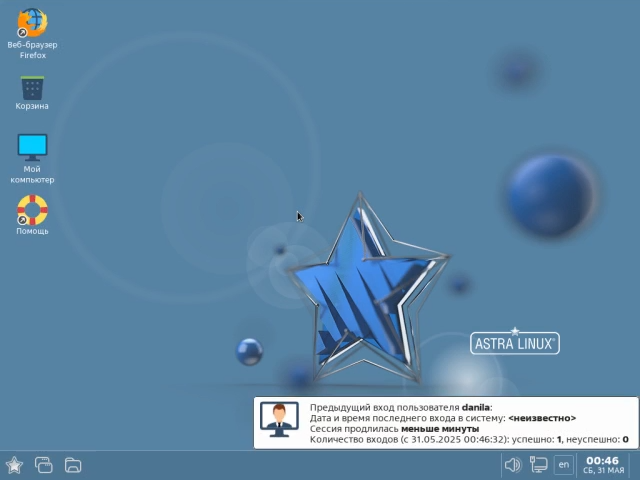
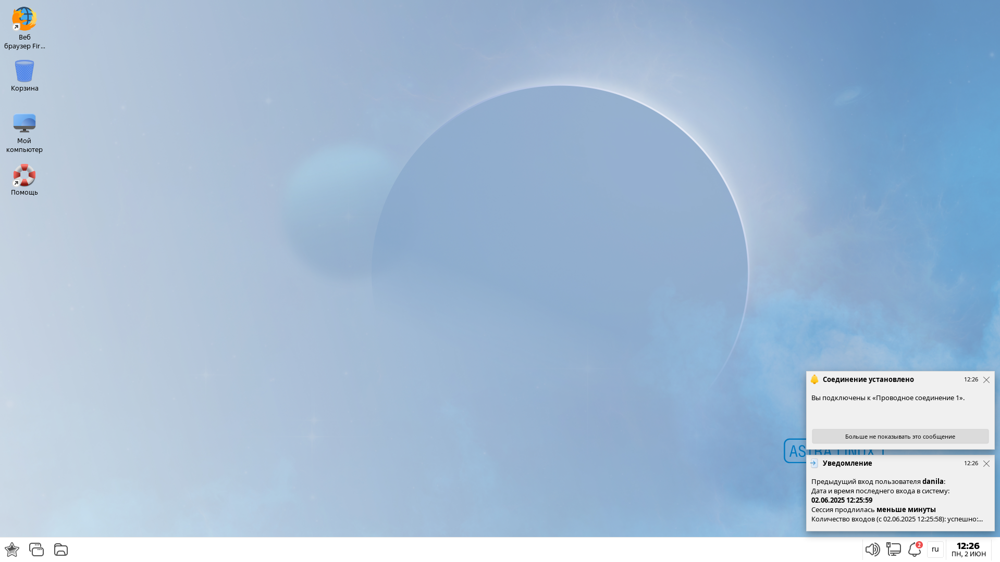

+++
title = 'Использование отечественного и свободного программного обеспечения'
type = 'docs'
+++

# Начало

Добро пожаловать в курс **Использование отечественного и свободного программного обеспечения**!

Этот курс разбит на несколько модулей, каждый из которых посвящён той или иной отечественной или свободной программе.

Каждый модуль включает в себя:
* теоретический блок, в котором Вы можете найти информацию об установке и применении программы, которой посвящён модуль;
* небольшой тест, направленный на проверку и закрепление полученных знаний;
* анкетирование, в котором Вы можете оценить качество представленных в модуле материалов.

# Входное анкетирование

Перед началом прохождения курса, пожалуйста, пройдите [входное анкетирование]().
Это поможет нам узнать, насколько Вы знакомы с отечественным и свободным ПО.

# Установка операционных систем

Данный раздел посвящён установке отечественных операционных систем.

## Astra Linux SE 1.7

Модуль посвящён установке операционной системы Astra Linux Special Edition 1.7

[Перейти к модулю](./docs/alse-17)

## Astra Linux SE 1.8

Модуль посвящён установке операционной системы Astra Linux Special Edition 1.8

[Перейти к модулю](./docs/alse-18)

---

# Настройка операционных систем

Данный раздел посвящён настройке элементов операционных систем

## Предварительная настройка пакетного менеджера Synaptic

Модуль посвящён предварительной настройке пакетного менеджера Synaptic для последующей установки пакетов

[Перейти к модулю](./docs/synaptic)

---

# Установка программ

## Яндекс Браузер

<!---->

Модуль посвящён установке Яндекс Браузера

[Перейти к модулю](./docs/yandex-browser)

## Офисный пакет ONLYOFFICE

Модуль посвящён установке офисного пакета ONLYOFFICE

[Перейти к модулю](./docs/onlyoffice)

## Офисный пакет Р7-Офис

Модуль посвящён установке офисного пакета Р7-Офис

[Перейти к модулю](./docs/r7-office)

## Редактор кода IDLE

Модуль посвящён установке редактора кода IDLE

[Перейти к модулю](./docs/idle)

## Интерактивная среда разработки OpenIDE

Модуль посвящён установке интерактивной среды разработки OpenIDE

[Перейти к модулю](./docs/openide)

## Интерактивная среда разработки PyCharm

Модуль посвящён установке интерактивной среды разработки PyCharm

[Перейти к модулю](./docs/pycharm)

## Редактор кода VSCodium

Модуль посвящён установке редактора кода VSCodium

[Перейти к модулю](./docs/vscodium)

## Редактор кода Visual Studio Code

Модуль посвящён установке редактора кода Visual Studio Code

[Перейти к модулю](./docs/vscode)

## Интерактивная среда разработки КуМир

Модуль посвящён установке интерактивной среды разработки КуМир

[Перейти к модулю](./docs/kumir)

---

# Анкетирование
