# Установка Astra Linux SE 1.7

## Загрузка образа

Для установки Astra Linux Special Edition 1.7 необходимо предварительно скачать образ установочного диска. Сделать это можно перейдя по адресу https://lk.astra.ru/ и авторизовавшись в личном кабинете пользователя Astra Linux.

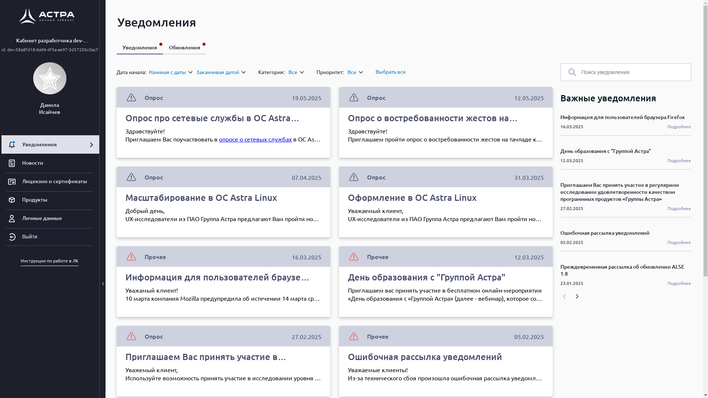

После авторизации в меню сайта нужно выбрать раздел «Продукты», в нём выбрать «ALSE» и перейти во вкладку «Обновления».

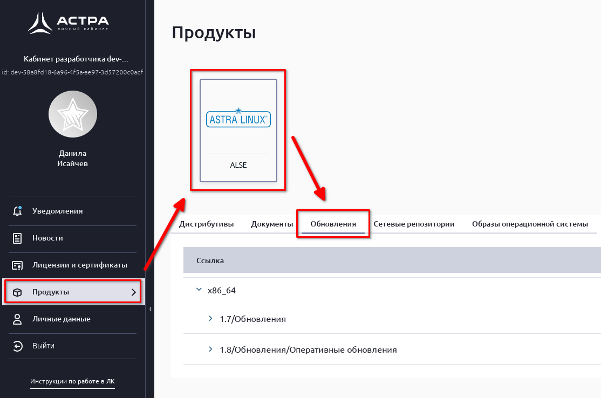

Во вкладке «Обновления» нужно выбрать раздел «1.7/Обновления», раскрыть подменю «Оперативные обновления» и выбрать самое последнее обновление.

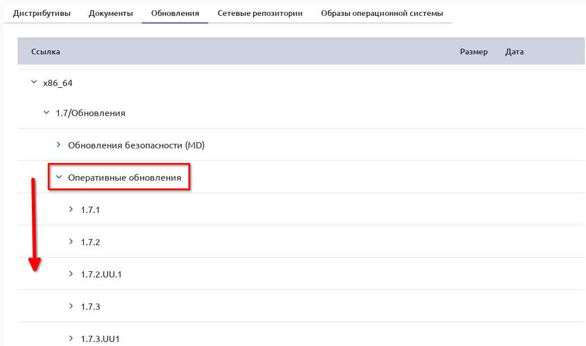

В выбранном обновлении нужно кликнуть по разделу «Технологический установочный диск» и выбрать файл с расширением .iso

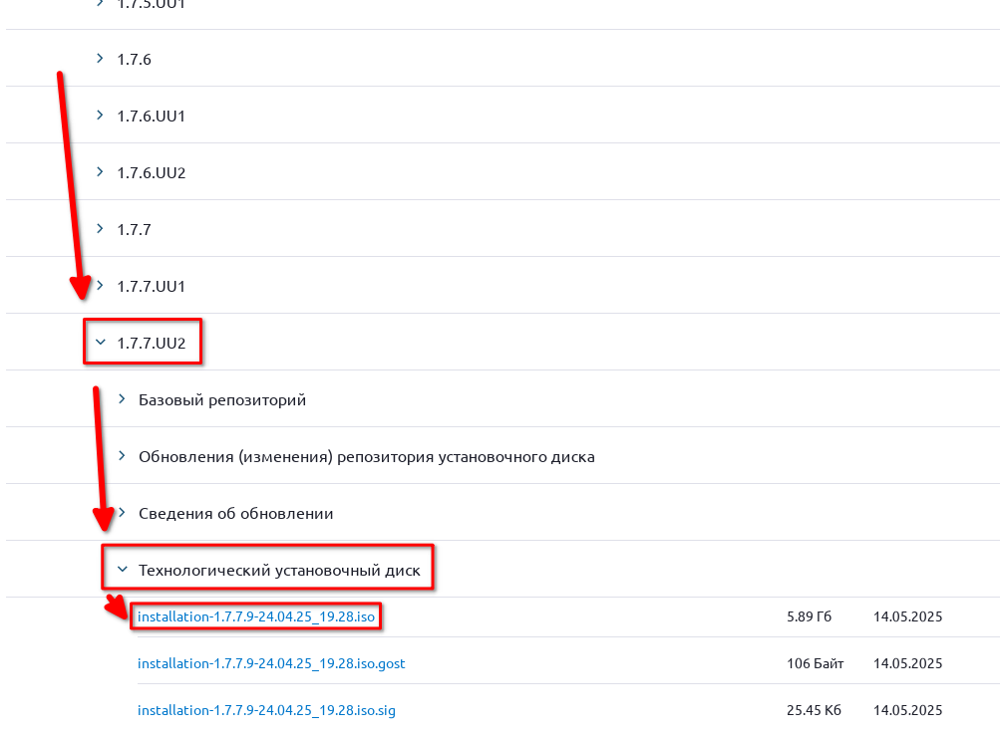

## Создание установочного носителя

Для установки Astra Linux на компьютер необходимо подготовить установочный носитель, используя скачанный образ технологического установочного диска. Для создания установочного носителя в операционной системе Windows можно использовать [Rufus](https://rufus.ie/ru/), в macOS – [balenaEtcher](https://etcher.balena.io), в операционных системах, использующих в своей основе ядро Linux – команду [dd](https://manpages.debian.org/testing/manpages-ru/dd.1.ru.html).

## Установка Astra Linux SE 1.7 второй системой

Если на компьютере уже установлена другая операционная система, можно установить Astra Linux второй системой для запуска в режиме dual boot. Тогда при включении компьютера можно будет выбирать, какую систему необходимо загрузить. Для простоты установки Astra Linux в dual boot рекомендуется предварительно создать на диске пустой раздел того объёма, который Вы хотите выделить выделить под Astra Linux.

## Установка Astra Linux SE 1.7

### Подготовка к установке

Чтобы установить Astra Linux необходимо подключить установочный носитель к компьютеру. После этого нужно включить компьютер и убедиться, что установочный носитель будет первым из устройств в списке загрузочных устройств. Сделать это можно перейдя в BIOS и проверив порядок устройств в подразделе Boot Device Priority раздела Boot.

Убедившись в том, что при запуске компьютера загрузка будет выполняться с установочного носителя, можно переходить к установке.

### Выбор языка и начало установки

Перед началом установки необходимо выбрать язык, который будет использоваться в процессе установки, после чего выбрать действие, которое мы хотим выполнить с использованием установочного носителя. На этом этапе управление происходит только при помощи клавиатуры. Используя клавиши стрелок вверх и вниз и клавишу Enter выберем русский язык и «Графическую установку». 

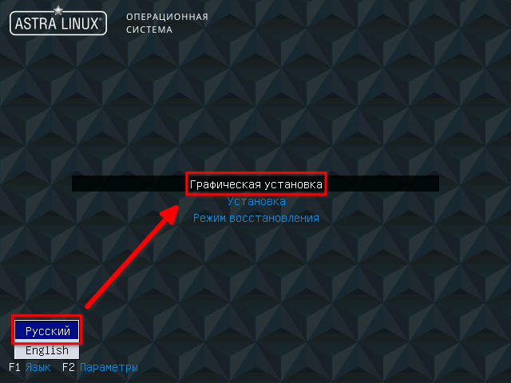

### Лицензионное соглашение

После запуска программы установки станет доступно управление с использованием клавиатуры и мыши. Для продолжения установки нужно прочитать и принять лицензионное соглашение, после чего нажать кнопку «Продолжить».

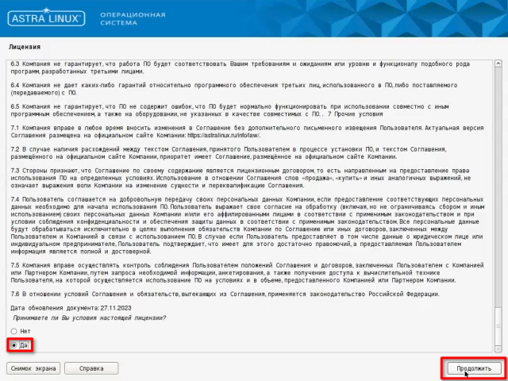

### Сочетание клавиш для смены раскладки

Следующим этапом программы установки будет выбор сочетания клавиш смены раскладки клавиатуры. Наиболее популярный вариант: Alt + Shift – будет предложен по умолчанию. При желании можно выбрать другое сочетание клавиш. Для перехода к следующему этапу установки необходимо нажать «Продолжить».

После этого программа установки сама загрузит необходимые для продолжения компоненты и произведёт попытку автоматической настройки сети.

### Настройки сети

Если компьютер не подключен к сети с использованием проводного подключения, попытка автоматической настройки сети будет провалена. В этом случае для упрощения процесса установки можно выбрать вариант «Пропустить пока настройку сети».

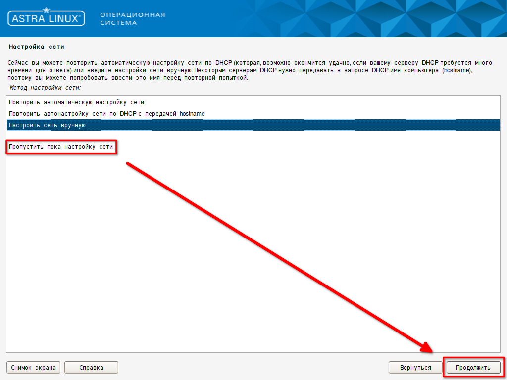

### Имя компьютера и домена

Следующий шаг – выбор имени компьютера. На данном этапе можно ввести любое соответствующее требованиям имя или оставить значение по умолчанию.

#### Требования к имени компьютера

В имени компьютера желательно использовать только латинские буквы, цифры, тире и нижнее подчёркивание. Нежелательно использовать слишком длинные имена (более 15 символов).

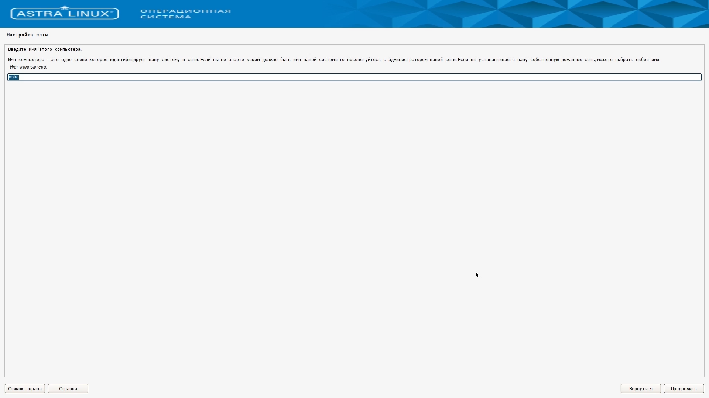

После выбора имени компьютера программа установки предложит ввести имя домена. При настройке компьютера для домашнего использования поле «Имя домена» можно оставить пустым.

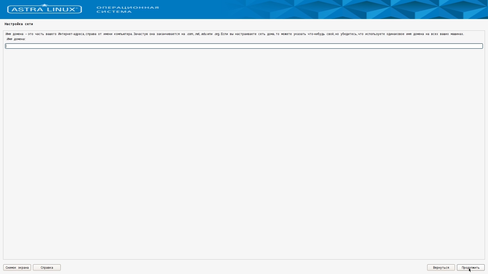

### Учётная запись администратора

Следующий шаг – настройка учётной записи администратора. Для начала нужно выбрать имя пользователя. Имя пользователя должно начинаться со строчной латинской буквы и может включать в себя: латинские буквы, цифры, тире и нижнее подчёркивание. Нельзя использовать имя admin, так как это имя зарезервировано системой.

При настройке компьютера для домашнего использования в качестве имени пользователя администратора можно использовать своё имя, записанное латинскими буквами.

Для завершения создания учётной записи администратора нужно ввести и подтвердить пароль администратора.

#### Требования к паролю

Длина пароля должна быть не менее восьми символов. В пароле можно использовать: латинские буквы, цифры и служебные символы.

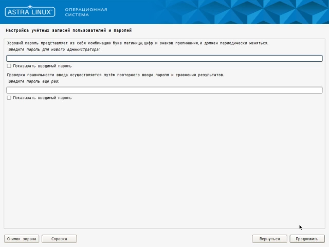

### Часовой пояс

После создания учётной записи администратора нужно выбрать из списка свой часовой пояс и нажать кнопку «Продолжить».

### Разметка диска

После выбора часового пояса программа установки предложит выбрать подходящий вариант автоматической разметки диска.

#### Установка в dual boot

При установке Astra Linux в dual boot выберем вариант: «Авто – использовать наибольшее свободное место». Он будет доступен для выбора, если Вы предварительно создали пустой раздел для Astra Linux.

#### Установка единственной операционной системой

При установке Astra Linux на компьютер в качестве единственной операционной системы выберем вариант: «Авто – использовать весь диск».

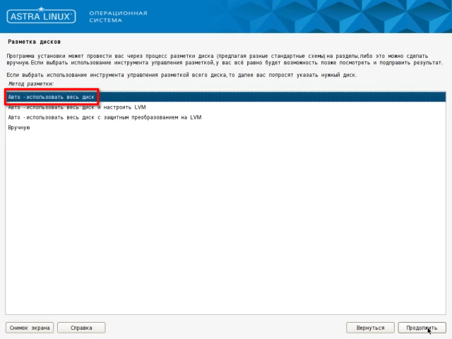

После выбора варианта разметки диска программа установки предложит выбрать размечаемый диск. Если в списке более одного диска, то нужно выбрать внутренний диск компьютера, на который предполагается установить Astra Linux. Для определения нужного диска в списке можно использовать отображаемые имя и объём.

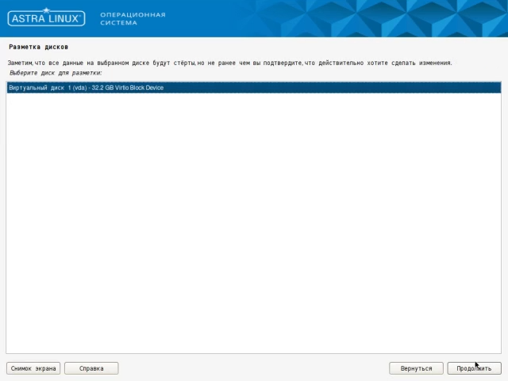

После выбора диска программа установки предложит определить, нужно ли создать отдельный раздел для каталога /home. Каталог /home используется для хранения личных файлов пользователей, в том числе каталогов: «Рабочий стол», «Документы», «Загрузки» и т.д. Для упрощения работы выберем вариант: «Все файлы в одном разделе».

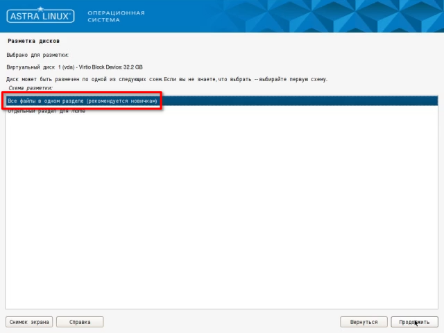

Если на этапе выбора варианта разметки диска был выбран один из вариантов автоматической разметки, программа установки продемонстрирует получившуюся схему разметки диска. Для продолжения установки нужно выбрать «Закончить разметку и записать изменения на диск» и нажать «Продолжить».

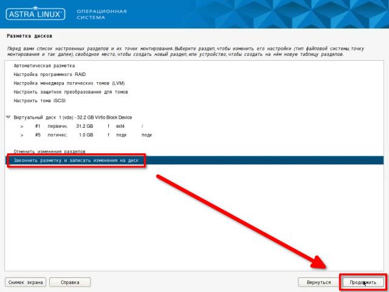

После этого программа установки опишет список действий, который будет выполнен с размечаемым диском и запросит подтверждение для начала разметки диска. Ответим «Да» на вопрос: «Записать изменения на диск?» и нажмём «Продолжить».

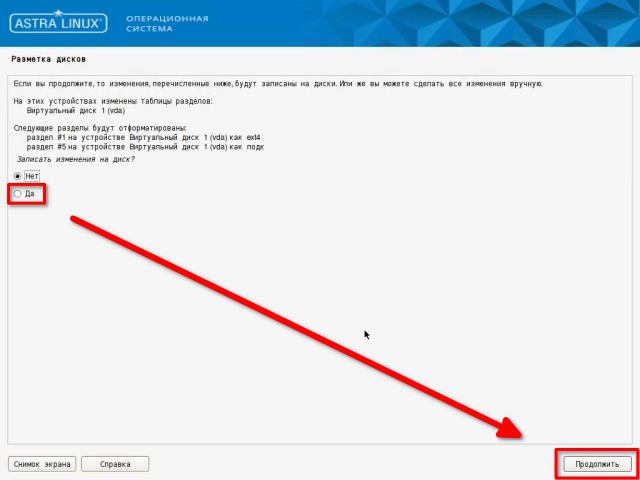

### Выбор версии ядра системы

После окончания процесса разметки диска нужно выбрать ядро системы. Выберем наиболее новое из доступных ядер.

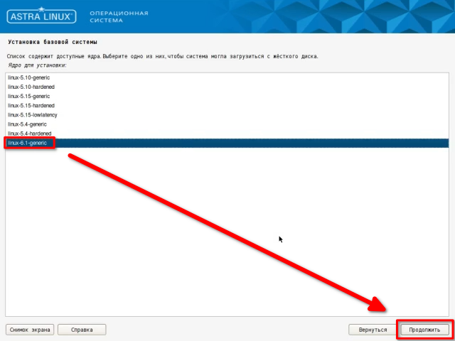

### Выбор дополнительных программ

После окончания установки ядра системы выберем дополнительные программы для установки. Выбор по умолчанию содержит оптимальный для домашнего использования набор програм, но, при желании, можно отметить дополнительные или убрать из списка ненужные программы. После определения списка дополнительных программ нажмём кнопку «Продолжить».

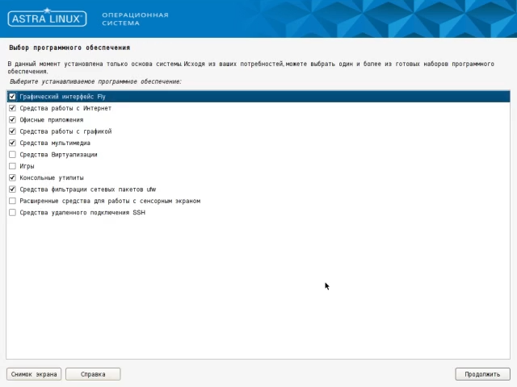

### Выбор уровня защищённости

После завершения установки дополнительных программ нужно выбрать уровень защищённости в соответствии с приобретённой лицензией. Для домашнего использования оптимальным выбором является базовый уровень защищённости «Орёл».

### Дополнительные настройки безопасности ОС

После выбора уровня защищённости программа установки предложит выбрать дополнительные настройки безопасности операционной системы. Набор настроек по умолчанию оптимален для домашнего использования.

### Установка загрузчика GRUB

Завершающим этапом установки операционной системы является установка и настройка загрузчика GRUB. Программа установки уточит, нужно ли установить загрузчик в главную загрузочную запись.

#### Установка в dual boot с другой системой Linux

Если Astra Linux устанавливается в dual boot к другой операционной системе **семейства Linux**, установка загрузчика не обязательна.

#### Установка единственной операционной системой или в dual boot к не-Linux системе

В остальных случаях нужно установить загрузчик в главную загрузочную запись, ответив «Да» и нажав кнопку «Продолжить».

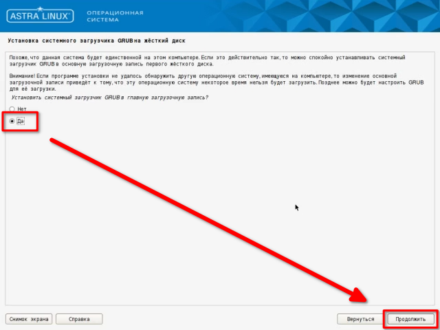

После завершения установки загрузчика GRUB нужно ввести и подтвердить пароль для него. Для удобства в качестве пароля GRUB можно использовать пароль от учётной записи администратора.

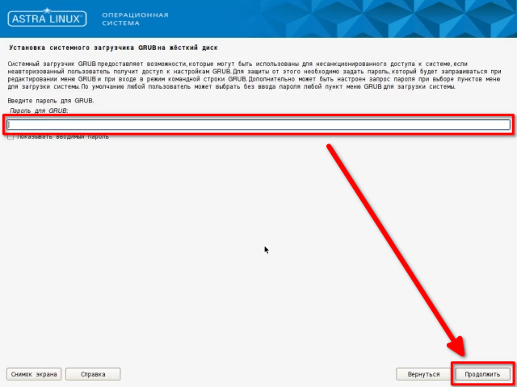

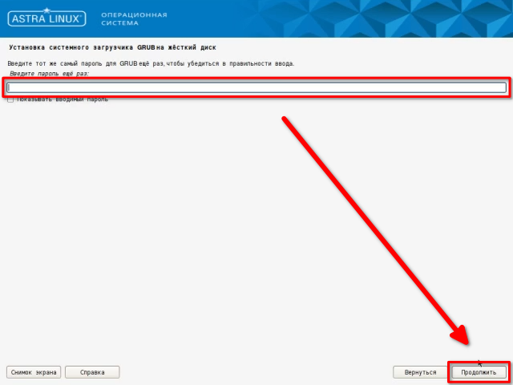

После обновления конфигурации GRUB программа установки перейдёт к экрану завершения установки. На этом этапе нужно извлечь установочный носитель и нажать кнопку «Продолжить».

## Первый запуск

Программа установки завершит свою работу и выполнит перезагрузку компьютера. После перезагрузки на экране появится меню загрузчика GRUB. Управление в нём осуществляется с помощью клавиш со стрелками вверх и вниз и клавиши Enter.

В меню загрузчика выберем первую опцию или подождём пять секунд до автоматического выбора опции по умолчанию. 

После загрузки на экране появится экран входа в систему. Введём в поля «Имя пользователя» и «Пароль» соответствующие значения, введённые на этапе создания учётной записи администратора, и нажмём кнопку «Войти».

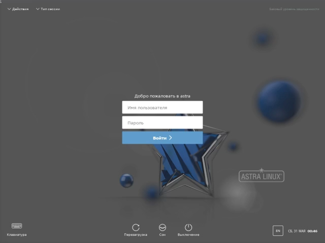

При первом входе после нажатия кнопки «Войти» запустится процесс инициализации пользователя, включающий в себя создание личного каталога пользователя.

После завершения процесса инициализации будет выполнен вход в систему, и на экране появится рабочий стол пользователя.

На этом процесс установки Astra Linux Special Edition 1.7 завершён.

# Тестирование

<iframe src="https://forms.yandex.ru/u/68516bb8d0468824836f8159?iframe=1" frameborder="0" name="ya-form-68516bb8d0468824836f8159" width="650"></iframe>

# Анкетирование

<iframe src="https://forms.yandex.ru/u/68527b8bf47e7356095a24c8?iframe=1" frameborder="0" name="ya-form-68527b8bf47e7356095a24c8" width="650"></iframe>
