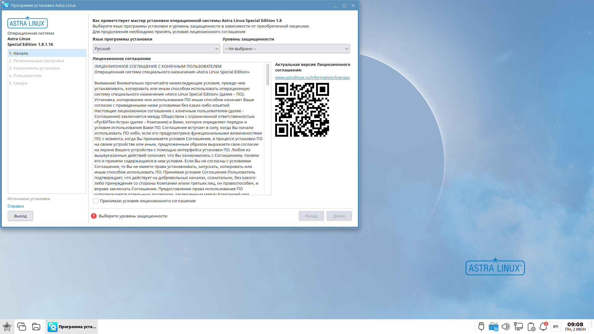
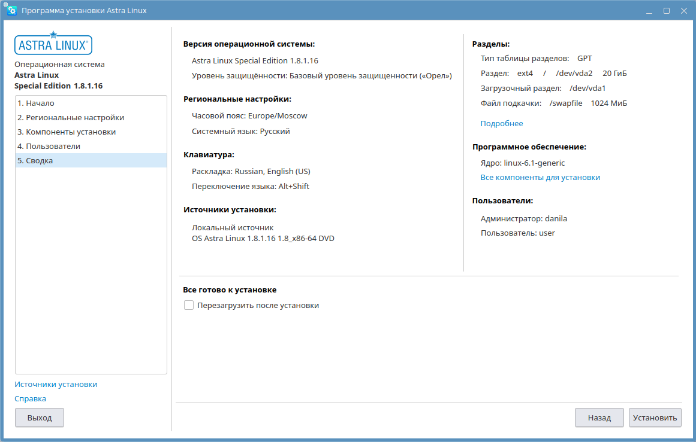

# Установка Astra Linux SE 1.8

## Загрузка образа

Для установки Astra Linux Special Edition 1.8 необходимо предварительно скачать образ установочного диска. Сделать это можно перейдя по адресу https://lk.astra.ru/ и авторизовавшись в личном кабинете пользователя Astra Linux.

После авторизации в меню сайта нужно выбрать раздел «Продукты», в нём выбрать «ALSE» и перейти во вкладку «Обновления».

Во вкладке «Обновления» нужно выбрать раздел «1.8/Обновления/Оперативные обновления» и выбрать самое последнее обновление.

В выбранном обновлении нужно кликнуть по разделу «Обновления (изменения) репозитория технологического установочного диска» и выбрать файл с расширением .iso

## Создание установочного носителя

Для установки Astra Linux на компьютер необходимо подготовить установочный носитель, используя скачанный образ технологического установочного диска. Для создания установочного носителя в операционной системе Windows можно использовать [Rufus](https://rufus.ie/ru/), в macOS – [balenaEtcher](https://etcher.balena.io/), в операционных системах, использующих в своей основе ядро Linux – команду [dd](https://manpages.debian.org/testing/manpages-ru/dd.1.ru.html).

## Установка Astra Linux SE 1.8 второй системой

Если на компьютере уже установлена другая операционная система, можно установить Astra Linux второй системой для запуска в режиме dual boot. Тогда при включении компьютера можно будет выбирать, какую систему необходимо загрузить. Для простоты установки Astra Linux в dual boot рекомендуется предварительно создать на диске пустой раздел того объёма, который Вы хотите выделить выделить под Astra Linux.

## Установка Astra Linux SE 1.8

### Подготовка к установке

Чтобы установить Astra Linux необходимо подключить установочный носитель к компьютеру. После этого нужно включить компьютер и убедиться, что установочный носитель будет первым из устройств в списке загрузочных устройств. Сделать это можно перейдя в BIOS и проверив порядок устройств в подразделе Boot Device Priority раздела Boot.

Убедившись в том, что при запуске компьютера загрузка будет выполняться с установочного носителя, можно переходить к установке.

<video controls width="100%">
  <source src="videos/installation.mp4" type="video/mp4" />
</video>

### Запуск программы установки

В отличии от установки Astra Linux SE 1.7 установка Astra Linux SE 1.8 происходит с LiveCD. Это позволяет попробовать операционную систему до её установки.

После загрузки LiveCD нужно дождаться запуска программы установки или запустить её вручную с помощью ярлыка на рабочем столе.

### Начало конфигурации установки

В начале установки нужно выбрать язык программы установки (по умолчанию – русский) и уровень защищённости в соответствии с приобретённой лицензией. Для домашнего использования оптимальным выбором является базовый уровень защищённости «Орёл».

После этого нужно прочитать и принять условия лицензионного соглашения и нажать кнопку «Далее».

### Региональные настройки

В ходе этого этапа «Региональные настройки» нужно выбрать часовой пояс, сочетание клавиш для смены раскладки клавиатуры и язык операционной системы. При желании, можно вручную установить дату и время, а также добавить дополнительные раскладки клавиатуры.

### Компоненты установки

На этапе «Компоненты установки» нужно выбрать диск для установки Astra Linux, профиль его разметки и ядро Linux. Для определения нужного диска в списке можно использовать отображаемые имя и объём.

#### Установка в dual boot

В программе установки Astra Linux SE 1.8 отсутствует опция автоматической разметки свободного пространства на диске, поэтому для установки в dual boot необходимо выбрать профиль «Ручная разметка» и открыть программу разметки диска.

В программе разметки диска нужно выбрать заранее выделенное свободное место и создать:
– раздел для загрузчика;
– раздел для корня файловой системы;
– файл подкачки.

Раздел загрузчика должен иметь тип файловой системы BIOS Boot для компьютеров с BIOS и EFI System Partition для компьютеров с UEFI. Размер и точка монтирования раздела BIOS Boot определяются программой разметки диска автоматически. Для раздела типа EFI System Partition нужно указать точку монтирования /boot/efi и выделить от 600 МБ до 1 ГБ памяти.

Раздел корня файловой системы должен иметь тип ext4 и точку монтирования /. Для него можно можно выделить всю оставшуюся память.

В соответствии с [официальной документацией](https://wiki.astralinux.ru/pages/viewpage.action?pageId=48759505) файл подкачки должен быть не менее 2-3 ГБ. Если на компьютере предполагается использовать режим сна, то файл подкачки может занимать от 4 ГБ до 16 ГБ.

#### Установка единственной операционной системой

При установке Astra Linux на компьютер в качестве единственной операционной системы выберем вариант: «Использовать все пространство на диске».

#### Выбор ядра Linux

Выберем рекомендуемое ядро Linux, на данный момент это - linux-6.1-generic.

Также на этапе «Компоненты установки», при желании, можно выбрать для установки дополнительные программы и настройки безопасности операционной системы, однако значения по умолчанию оптимальны для домашнего использования.

### Пользователи

На этапе «Пользователи» нужно выбрать имя компьютера, имя администратора для входа в систему, ввести и подтвердить пароль администратора.

#### Требования к имени компьютера

Имя компьютера должно состоять только из латинских букв, цифр, тире и нижнего подчёркивания. Нежелательно использовать слишком длинные имена (более 15 символов).

#### Требования к имени пользователя для входа в систему

Имя для входа в систему должно начинаться со строчной латинской буквы, оно может включать в себя латинские буквы, цифры, тире и нижнее подчёркивание. Максимальная длина имени для входа – 32 символа.

#### Требования к паролю

Пароль может состоять из латинских букв, цифр и служебных символов. Минимальная длина пароля – 8 символов.

При желании для полей «Имя компьютера» и «Имя для входа в систему» можно оставить значения по умолчанию.

При желании на этом этапе можно сразу же создать других пользователей, для этого нужно нажать кнопку «Добавить», после чего ввести: имя для входа в систему, пароль и подтверждение пароля, после чего нажать кнопку «Сохранить».

### Сводка

Последний этап перед установкой системы – «Сводка». На нём программа установки демонстрирует сводку по всем предыдущим этапам. Нужно с ней ознакомиться и, убедиться, что всё верно.

При желании можно отметить галочкой пункт «Перезагрузить после установки», чтобы по завершении установки компьютер автоматически перезагрузился. После этого необходимо нажать кнопку «Установить» и подтвердить начало установки.

Если на этапе «Сводка» не была отмечен пункт «Перезагрузить после установки», по завершении процесса установки нужно нажать кнопку «Перезагрузить». После чего программа установки завершит свою работу и выполнит перезагрузку компьютера.

## Первый запуск

После перезагрузки на экране появится меню загрузчика GRUB. Управление в нём осуществляется с помощью клавиш со стрелками вверх и вниз и клавиши Enter. В меню GRUB необходимо выбрать первую опцию или подождать пять секунд до автоматического выбора опции по умолчанию.

После загрузки на экране появится экран входа в систему. Введём в поля «Имя пользователя» и «Пароль» соответствующие значения, введённые на этапе создания учётных записей пользователей программы установки Astra Linux Special Edition 1.8 и нажмём кнопку «Войти».

При первом входе после нажатия кнопки «Войти» запустится процесс инициализации пользователя, включающий в себя создание личного каталога пользователя

После завершения процесса инициализации будет выполнен вход в систему, и на экране появится рабочий стол пользователя.

На этом процесс установки Astra Linux Special Edition 1.8 завершён.

# Тестирование

<iframe src="https://forms.yandex.ru/u/68529fe649363961877dc24f?iframe=1" frameborder="0" name="ya-form-68529fe649363961877dc24f" width="650"></iframe>

# Анкетирование

<iframe src="https://forms.yandex.ru/u/68529f3b02848f623bb0ed1f?iframe=1" frameborder="0" name="ya-form-68529f3b02848f623bb0ed1f" width="650"></iframe>
