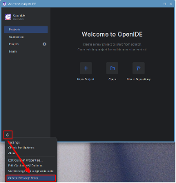
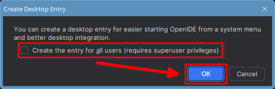

# Установка интерактивной среды разработки OpenIDE

OpenIDE – это отечественная свободная среда разработки основанная
на IntelliJ IDEA Community Edition. Она используется для разработки на различных популярных языках программирования, в том числе и Python.

## Скачивание архива с программой

Для скачивания архива с программной нужно зайти на страницу загрузки OpenIDE на официальном сайте: https://openide.ru/download/, выбрать операционную систему Linux и нажать кнопку «Скачать».

## Установка

После завершения скачивания перейдём к архиву, щёлкнем по нему правой кнопкой мыши и выберем «Распаковать в эту папку».

Переименуем извлечённую из архива папку в «openIDE» (для того чтобы переименовать папку, можно щёлкнуть по ней правой кнопкой мыши и выбрать «Переименовать» или выделить папку и нажать на клавиатуре клавишу F2).

Запустим терминал и выполним в нём команду:

```bash
sudo mv ./Загрузки/openIDE /opt
```

После этого OpenIDE будет установлен.

## Первый запуск

Для первого запуска воспользуемся командой:

```bash
/opt/openIDE/bin/openide
```

Прочитаем и примем лицензионное соглашение, после чего создадим ярлык для запуска OpenIDE, нажав на кнопку с шестерёнкой в левом нижнем углу и выбрав «Create Desktop Entry».



Далее появится окно, запрашивающее подтверждение создания ярлыка. Отметим галочкой «Create entry for all users», чтобы ярлык для запуска OpenIDE из меню «Пуск» был доступен всем пользователям. Нажмём «OK» и введём пароль администратора.



## Запуск OpenIDE

После этого в разделе «Разработка» меню «Пуск» (Astra Linux SE 1.7) или в подразделе «Разработка» раздела «Программы» меню «Пуск» (Astra Linux SE 1.8) появится ярлык для запуска OpenIDE.

# Анкетирование

<script src="https://forms.yandex.ru/_static/embed.js"></script><iframe src="https://forms.yandex.ru/u/6852af3d02848f6799b0ed19?iframe=1" frameborder="0" name="ya-form-6852af3d02848f6799b0ed19" width="650"></iframe>
